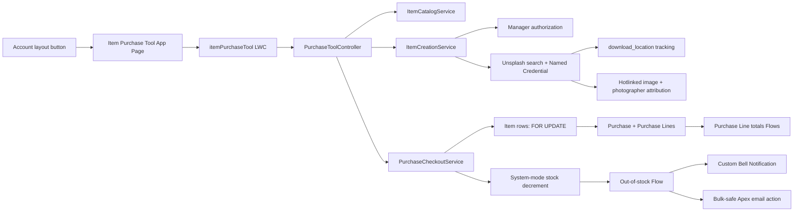

# Item Purchase Tool

Одностраничное Salesforce-приложение для формирования покупки из карточки Account. Пользователь ищет и фильтрует товары, собирает корзину и оформляет Purchase; менеджер дополнительно создаёт товары с изображением из Unsplash. Остатки, итоги покупки и уведомления об исчерпании запаса обрабатываются на платформе Salesforce.

Проект реализован на Salesforce API 67.0 без Aura и без клиентского доступа к секретам.

## Возможности

- запуск Item Purchase Tool кнопкой с Account layout в отдельной вкладке;
- отображение Account Name, Account Number и Industry;
- поиск по Item Name и Description, фильтрация по Type и Family;
- карточки товаров, изображения, детали в модальном окне и счётчик результатов;
- корзина с количеством, построчными суммами, общей суммой и проверкой остатков;
- атомарный checkout с серверной ценой, блокировкой Item и откатом всей транзакции при ошибке;
- создание Purchase и PurchaseLine, уменьшение Available Quantity и переход на стандартную страницу Purchase;
- создание Item только для пользователя с `User.IsManager__c = true` и manager permission set;
- получение изображения через Unsplash API с защищённым Access Key, обязательной регистрацией выбора и атрибуцией фотографа;
- автоматический расчёт `TotalItems__c` и `GrandTotal__c` Record-Triggered Flow;
- Bell и email-уведомления при переходе остатка товара в ноль;
- permission sets для обычного пользователя и менеджера;
- Apex unit tests, LWC Jest tests, ESLint, Prettier и GitHub Actions.

## Архитектура



### Слои

| Слой            | Компоненты                                                             | Ответственность                                                      |
| --------------- | ---------------------------------------------------------------------- | -------------------------------------------------------------------- |
| UI              | `itemPurchaseTool`, `itemTile`, `itemImage`, модальные LWC             | Каталог, корзина, события, навигация и единая атрибуция изображений  |
| UI utilities    | `itemPresentation`, `componentEvents`, `modalShell`                    | Общие presentation rules, события и SLDS modal shell без копирования |
| Application API | `PurchaseToolController`                                               | Узкий `@AuraEnabled`-контракт и стабильные сообщения об ошибках      |
| Domain services | `ItemCatalogService`, `ItemCreationService`, `PurchaseCheckoutService` | Поиск, создание товара, checkout и правила склада                    |
| Security        | `PurchaseToolAuthorization`, permission sets                           | Manager gate, CRUD/FLS, sharing и доступ к External Credential       |
| Integration     | `UnsplashClient`, Named/External Credential                            | Search, проверка URL, download tracking и защита Access Key          |
| Automation      | 3 Record-Triggered Flows, 2 invocable Apex actions                     | Итоги Purchase, Bell и email-уведомления                             |
| Metadata        | Objects, fields, layouts, app, tab, button, template, settings         | Декларативная модель и пользовательский доступ                       |
| Tests           | 6 Apex test classes, 8 Jest suites                                     | Позитивные, негативные, rollback, Flow и UI-сценарии                 |

### Checkout-транзакция

1. Сервер проверяет Account и нормализует корзину, объединяя повторяющиеся Item.
2. Item читаются в user mode и блокируются `FOR UPDATE`.
3. Сервер повторно проверяет цену, целое количество и доступный остаток.
4. Purchase и PurchaseLine создаются контролируемым system-mode участком; прямой Create на эти objects пользователю не выдан.
5. Record-Triggered Flow пересчитывает `TotalItems__c` и `GrandTotal__c`.
6. Остатки уменьшаются через узкий system-mode gateway.
7. При переходе количества в ноль второй Flow отправляет Bell и email.
8. Любая необработанная ошибка откатывает Purchase, строки и изменения остатков к savepoint.

## Модель данных

| Object                               | Field                      | Type                | Назначение                                     |
| ------------------------------------ | -------------------------- | ------------------- | ---------------------------------------------- |
| `Purchase__c`                        | `Name`                     | Text                | Человекочитаемое имя покупки                   |
| `Purchase__c`                        | `ClientId__c`              | Lookup(Account)     | Account, для которого создана покупка          |
| `Purchase__c`                        | `TotalItems__c`            | Number(18,0)        | Сумма количеств строк, обновляется Flow        |
| `Purchase__c`                        | `GrandTotal__c`            | Number(18,2)        | Сумма `Amount × UnitCost`, обновляется Flow    |
| `PurchaseLine__c`                    | `PurchaseId__c`            | Master-Detail       | Родительская покупка                           |
| `PurchaseLine__c`                    | `ItemId__c`                | Master-Detail       | Купленный товар                                |
| `PurchaseLine__c`                    | `Amount__c`                | Number(18,0)        | Количество                                     |
| `PurchaseLine__c`                    | `UnitCost__c`              | Number(18,2)        | Цена на момент checkout                        |
| `PurchaseLine__c`                    | `LineTotal__c`             | Formula Number      | `Amount × UnitCost`, используется bulk totals  |
| `Item__c`                            | `Name`                     | Text                | Название товара и запрос к Unsplash            |
| `Item__c`                            | `Description__c`           | Text(255)           | Описание, доступное для SOQL `LIKE`-поиска     |
| `Item__c`                            | `Type__c`                  | Restricted Picklist | Product, Accessory, Supply, Equipment          |
| `Item__c`                            | `Family__c`                | Restricted Picklist | Electronics, Furniture, Office Supplies, Other |
| `Item__c`                            | `Image__c`                 | URL                 | Изображение с `images.unsplash.com`            |
| `Item__c`                            | `Unsplash_Photographer__c` | Text(255)           | Имя автора для обязательной атрибуции          |
| `Item__c`                            | `Unsplash_Profile_URL__c`  | URL                 | Профиль автора с referral UTM-параметрами      |
| `Item__c`                            | `Price__c`                 | Number(18,2)        | Серверная цена                                 |
| `Item__c`                            | `AvailableQuantity__c`     | Number(18,0)        | Текущий остаток                                |
| `User`                               | `IsManager__c`             | Checkbox            | Разрешение бизнес-уровня на создание Item      |
| `Inventory_Notification_Settings__c` | `Recipient_User__c`        | Text(18)            | Salesforce User Id для Bell                    |
| `Inventory_Notification_Settings__c` | `Recipient_Email__c`       | Email               | Адрес для email-уведомлений                    |

`Recipient_User__c` хранится как Text(18), поскольку Salesforce не поддерживает relationship fields в Hierarchy Custom Settings. API name сохранён по техническому заданию, а Flow дополнительно проверяет, что User существует и активен.

## Структура репозитория

```text
.
├── .github/workflows/quality.yml
├── config/project-scratch-def.json
├── force-app/main/default
│   ├── applications
│   ├── classes
│   ├── cspTrustedSites
│   ├── email
│   ├── externalCredentials
│   ├── flexipages
│   ├── flows
│   ├── layouts
│   ├── lwc
│   ├── namedCredentials
│   ├── notificationtypes
│   ├── objects
│   ├── permissionsets
│   └── tabs
├── manifest/package.xml
├── scripts/configure-unsplash.ps1
├── eslint.config.js
├── jest.config.js
├── package.json
├── pnpm-lock.yaml
├── prettier.config.js
└── sfdx-project.json
```

## Технологии и зависимости

### Runtime

- Salesforce Apex 67.0;
- Lightning Web Components;
- Salesforce Lightning Design System;
- Record-Triggered Flows;
- Salesforce Named Credentials и External Credentials;
- Hierarchy Custom Setting;
- Classic Text Email Template;
- Custom Notification Type.

### Инструменты разработки

| Инструмент                  | Проверенная версия |
| --------------------------- | ------------------ |
| Node.js                     | 22                 |
| pnpm                        | 11.9.0             |
| Salesforce CLI              | 2.143.6            |
| `@salesforce/sfdx-lwc-jest` | 7.9.0              |
| ESLint                      | 9.39.5             |
| Prettier                    | 3.9.5              |
| `prettier-plugin-apex`      | 2.3.0              |

Runtime npm-зависимостей нет. Node-пакеты нужны только для форматирования, lint и LWC unit tests.

## Как открыть уже готовое приложение

Item Purchase Tool — облачное Salesforce-приложение, а не сайт с локальным сервером. Для обычной проверки не нужно скачивать проект, устанавливать Node.js или запускать команду в терминале.

Dev Org уже настроена и развёрнута под alias `item-purchase-dev`. Откройте готовую страницу:

[Открыть Item Purchase Tool для Demo Customer](https://orgfarm-3f2fc6c37b-dev-ed.develop.lightning.force.com/lightning/n/Item_Purchase_Tool?c__accountId=001dL00002MFkXwQAL)

Если Salesforce сначала покажет форму входа, войдите в подготовленный Developer Edition аккаунт и ещё раз откройте ссылку. В URL уже передан Account `Demo Customer`, поэтому отдельно выбирать клиента не требуется.

Для быстрой проверки:

1. Убедитесь, что вверху показан Account `Demo Customer`.
2. Введите `chair` в поиск: каталог должен оставить карточку офисного кресла.
3. Очистите поиск и попробуйте фильтры Type и Family.
4. Добавьте товар с положительным остатком в Cart, измените количество и выполните Checkout.
5. Убедитесь, что Salesforce открыл созданный Purchase с Purchase Lines и рассчитанными итогами.
6. Проверьте, что у `Desk Lamp` с нулевым остатком кнопка добавления недоступна.

В Dev Org уже подготовлены:

- Account `Demo Customer`, Id `001dL00002MFkXwQAL`;
- четыре демонстрационных Item с проверенными авторами Unsplash и видимой атрибуцией;
- оба permission set и `User.IsManager__c = true` у текущего пользователя;
- активный System Administrator с email `dev@truesolv.com`.

Unsplash Access Key настроен в Dev Org как зашифрованный параметр External Credential. Серверный поиск фотографии и данных автора через Named Credential проверен реальным callout; значение ключа не хранится в проекте.

## Предварительные требования

- Salesforce Developer Edition org или scratch org с Lightning Experience;
- включённый Dev Hub для scratch org сценария;
- Salesforce CLI `sf`;
- Node.js 22 и pnpm;
- Unsplash developer account, зарегистрированное приложение и Access Key;
- права администратора для deployment и post-install конфигурации.

## Локальная установка только для разработки

Этот раздел нужен разработчику для изменения исходников и повторного deployment. Для просмотра уже готового приложения используйте ссылку выше.

```powershell
pnpm install --frozen-lockfile
sf org login web --instance-url https://login.salesforce.com --alias item-purchase-dev --set-default
```

## Deployment

Для Developer Edition org:

```powershell
sf project deploy validate --manifest manifest/package.xml --target-org item-purchase-dev --test-level RunLocalTests --wait 30
sf project deploy start --manifest manifest/package.xml --target-org item-purchase-dev --test-level RunLocalTests --wait 30
```

Manifest содержит явные entries для email folder и template; wildcard для folder-based metadata намеренно не используется.

После deployment выполните post-install настройку, а затем серверные тесты:

```powershell
sf apex run test --test-level RunLocalTests --target-org item-purchase-dev --wait 30 --code-coverage --result-format human
```

Для scratch org:

```powershell
sf org login web --instance-url https://login.salesforce.com --alias item-purchase-devhub --set-default-dev-hub
sf org create scratch --target-dev-hub item-purchase-devhub --definition-file config/project-scratch-def.json --alias item-purchase-scratch --set-default --duration-days 7
sf project deploy start --manifest manifest/package.xml --target-org item-purchase-scratch --wait 30
```

## Post-install конфигурация

В текущей Dev Org permission sets, manager flag, получатели уведомлений, проверочный администратор и demo data уже настроены. Отдельно остаётся добавить только Unsplash Access Key, если нужно создавать новые Item.

### 1. Unsplash Access Key

Секрет не входит в metadata, package или Git. Это обязательное ограничение Salesforce External Credentials.

В Unsplash Developers откройте `Your apps` → `New Application`, лично подтвердите четыре API Guidelines и примите API Terms, затем создайте demo application и скопируйте Access Key. Принятие юридических условий нельзя делегировать; ключ нельзя присылать в чат или добавлять в репозиторий.

```powershell
$env:UNSPLASH_ACCESS_KEY = 'your-access-key'
pnpm configure:unsplash item-purchase-dev
Remove-Item Env:UNSPLASH_ACCESS_KEY
```

Скрипт передаёт ключ в Connect REST API через stdin. Ключ не записывается в файл и не попадает в командную строку дочернего процесса.

Эквивалентная ручная настройка:

1. Откройте Setup → Named Credentials → External Credentials.
2. Выберите `Unsplash API Key` (`Unsplash_API_Key`).
3. В principal `Unsplash_Principal` добавьте Authentication Parameter:
   - Name: `AccessKey`;
   - Value: Unsplash Access Key.
4. Убедитесь, что статус principal — Configured.

### 2. Permission sets и manager flag

У текущего пользователя Dev Org уже назначены `Item_Purchase_User` и `Item_Purchase_Manager`, а `IsManager__c` установлен в `true`.

Обычному пользователю назначается базовый permission set. Значение после `--on-behalf-of` — Salesforce Username, а не поле Email:

```powershell
sf org assign permset --name Item_Purchase_User --target-org item-purchase-dev --on-behalf-of user@example.com
```

Профиль прикладного пользователя не должен отдельно выдавать Create/Edit на `Purchase__c` и `PurchaseLine__c`: permission set умеет только добавлять права и не может отозвать уже выданные профилем. System Administrator остаётся доверенным исключением с полным доступом.

Менеджеру назначаются оба permission sets. Здесь также используются Salesforce Username:

```powershell
sf org assign permset --name Item_Purchase_User --target-org item-purchase-dev --on-behalf-of manager@example.com
sf org assign permset --name Item_Purchase_Manager --target-org item-purchase-dev --on-behalf-of manager@example.com
```

Для менеджера также установите `User.IsManager__c = true`. Один permission set не заменяет этот business flag: сервер проверяет оба уровня доступа.

```powershell
sf data update record --sobject User --record-id <USER_ID> --values "IsManager__c=true" --target-org item-purchase-dev
```

### 3. Получатели складских уведомлений

1. Откройте Setup → Custom Settings.
2. Выберите `Inventory Notification Settings` → Manage.
3. Создайте Organization Default Value.
4. В `Recipient User ID` укажите 18-символьный Id активного User.
5. В `Recipient Email` укажите email получателя.

Hierarchy позволяет при необходимости переопределить значения на уровне Profile или User.

### 4. Admin user для проверяющего

В текущей Dev Org активный пользователь с email `dev@truesolv.com` уже создан с профилем System Administrator, manager flag и обоими permission sets.

В Developer org откройте Setup → Users → New User и создайте активного пользователя с:

- Email: `dev@truesolv.com`;
- User License: Salesforce;
- Profile: System Administrator;
- уникальным глобальным Username;
- включённой отправкой письма с временным паролем.

## Использование

1. Для готовой Dev Org откройте прямую ссылку из раздела «Как открыть уже готовое приложение».
2. Альтернативный путь: App Launcher → Item Purchase → Account → кнопка `Item Purchase Tool`.
3. Найдите товары, добавьте их в Cart и выполните Checkout.
4. После успеха Salesforce откроет стандартную Purchase layout с Purchase Lines.
5. Для создания нового Item нужен менеджер с обоими permission sets, `IsManager__c = true` и настроенным Unsplash Access Key.

## Automation

| Flow                                 | Trigger                                        | Результат                                |
| ------------------------------------ | ---------------------------------------------- | ---------------------------------------- |
| `Purchase_Line_Totals_After_Save`    | PurchaseLine create/update, after save         | Пересчитывает итоги текущего Purchase    |
| `Purchase_Line_Totals_Before_Delete` | PurchaseLine delete, before delete             | Пересчитывает итоги без удаляемой строки |
| `Notify_When_Item_Out_Of_Stock`      | Item update, quantity changed to 0, after save | Bell и email из Hierarchy Custom Setting |

Bell notification:

- Title: `Item Out of Stock`;
- Message: `The item "{Item Name}" is out of stock. Please review inventory and take the necessary action.`

Email использует template `Out of Stock Item Notification`. Apex action готовит сообщения по шаблону и передаёт их в один `Messaging.sendEmail` call, чтобы не расходовать governor limit на каждую запись отдельно.

## Безопасность и целостность

- все entry-point и service-классы работают `with sharing`;
- пользовательские запросы и Item creation DML используют `WITH USER_MODE`/`AccessLevel.USER_MODE`;
- system mode ограничен созданием Purchase/Lines через защищённый checkout, пересчётом итогов, складским decrement и чтением заранее настроенного email template;
- базовый permission set не даёт прямой Create/Edit на Purchase и PurchaseLine, поэтому API или related list не обходят серверную цену и stock decrement;
- профили прикладных пользователей также не должны давать эти права, поскольку permission set не умеет их отнимать;
- `Purchase__c` имеет Private OWD, а PurchaseLine наследует доступ от родителя; покупатель видит собственную созданную запись, но не покупки других пользователей;
- manager status повторно проверяется в Apex;
- цена и остаток никогда не принимаются от LWC как доверенные значения;
- `FOR UPDATE` предотвращает overselling при параллельном checkout;
- savepoint обеспечивает атомарный rollback;
- динамический SOQL использует bind variables;
- базовый permission set явно открывает FLS для permissionable optional fields: Account Number, Industry, Item Description/Image/attribution, Line Total и manager flag;
- required и Master-Detail fields не допускают отдельных `fieldPermissions` в API 67.0 и доступны по платформенной семантике вместе с object access;
- manager permission set добавляет Create/Edit Item и edit FLS для optional полей; доступ к обязательным Item fields следует из object permission;
- Access Key хранится в зашифрованном User External Credential;
- permission set менеджера предоставляет только минимальный `Read + View All` к `UserExternalCredential`;
- CSP разрешает изображения только с `https://images.unsplash.com`;
- `UnsplashClient` принимает только hotlinked `photo.urls.small`, профиль на `unsplash.com` и `download_location` на `api.unsplash.com`; безопасные query-параметры сохраняются без изменения, fragment и неподдерживаемые символы отклоняются;
- `itemImage` показывает «Photo by … on Unsplash» во всех местах отображения API-фотографии, не приписывает Unsplash внешним URL и скрывает Unsplash-фото без проверенных данных автора;
- delete для Item пользователям не выдаётся, поскольку dual Master-Detail может каскадно удалить исторические Purchase Lines.

## Проверки качества

```powershell
pnpm format:verify
pnpm lint
pnpm test:unit
pnpm test:unit:coverage
```

Текущий подтверждённый результат:

- 8 Jest suites, 27 tests — passed;
- ESLint — passed;
- Prettier — passed;
- XML metadata parse и проверка отсутствия комментариев в коде — passed;
- source-to-Metadata API conversion: 89 файлов, без предупреждений;
- Dev Org deployment `0AfdL00000dr5G3SAI`: 70/70 компонентов, без ошибок;
- test-only deployments `0AfdL00000drdj7SAA` и `0AfdL00000drfGHSAY`: 3/3 и 1/1 компонентов;
- check-only manifest validation `0AfdL00000dr4WsSAI`: 72/72 компонентов и 27/27 deployment tests, без ошибок;
- отдельный Apex run `707dL00001FIrxu`: 32/32 tests passed, test-run coverage 92%, org-wide coverage 91%;
- Apex tests не используют `SeeAllData=true`.

Текущий Unsplash/FLS hardening развёрнут в Dev Org и прошёл полный отдельный `RunLocalTests`. Unmanaged package 1.2 был загружен раньше и эту версию ещё не содержит.

GitHub Actions запускает install, formatting check, ESLint и Jest при push в `main` и для pull request.

## Delivery

| Результат                          | Текущий статус                                                                                                      |
| ---------------------------------- | ------------------------------------------------------------------------------------------------------------------- |
| GitHub repository URL              | Приватный репозиторий: `https://github.com/KIMovchanin/salesforce_tz`; `main` содержит текущий проверенный snapshot |
| Dev Org deployment                 | Успешно: `0AfdL00000dr5G3SAI`, 70/70 компонентов                                                                    |
| Apex server tests                  | 32/32 passed, run `707dL00001FIrxu`, test-run coverage 92%, org-wide coverage 91%                                   |
| Admin `dev@truesolv.com`           | Создан и настроен                                                                                                   |
| Demo data                          | `Demo Customer` и четыре Item созданы; авторы и профильные URL Unsplash проверены и заполнены                       |
| Unmanaged package installation URL | Версия 1.2 относится к предыдущему snapshot; текущий deployment в неё не входит                                     |
| Unsplash Access Key                | Настроен в Dev Org; серверный callout к Unsplash успешно проверен                                                    |

## Unmanaged package

Unmanaged package предыдущей server-side версии создан и загружен:

- package: `Item Purchase Tool`;
- package Id: `033dL000000fPdZ`;
- version: `1.2`;
- version Id: `04tdL000000kBtJQAU`;
- upload request: `0HDdL0000000253WAA`;
- status: `SUCCESS`.

[Установить Item Purchase Tool 1.2 в другую Salesforce org](https://login.salesforce.com/packaging/installPackage.apexp?p0=04tdL000000kBtJQAU)

Версия 1.2 не содержит развёрнутые изменения Unsplash attribution/download tracking и исправленный FLS. Для распространения текущего snapshot через unmanaged package потребуется загрузить следующую версию.

Access Key и записи Hierarchy Custom Setting не входят в package и настраиваются в каждой установленной org отдельно. Unmanaged package не поддерживает upgrades; повторное распространение выполняется новым package или source deployment.

## Принятые решения и ограничения

- `Description__c` — Text(255), а не Long Text Area, чтобы требуемый поиск Name/Description работал через SOQL `LIKE`.
- Значения Type и Family заданы проектом, поскольку техническое задание не определяет наборы picklist.
- Каталог ограничен 500 результатами на запрос; счётчик показывает именно выведенные записи.
- Checkout принимает не более 100 входных строк и пока не использует idempotency key для сетевого повтора запроса.
- Числовые цены отображаются в USD в соответствии с макетом; поля модели остаются Number, как указано в задании.
- `Account-Account Layout` предназначена для чистой Developer org. В существующей org deployment одноимённой layout может заменить её кастомизацию; перед установкой следует retrieve и merge.
- Account button использует стандартный `newWindow`; конкретный браузер может открыть новую вкладку или окно.
- Secret и Custom Setting values не версионируются и не упаковываются.

## Troubleshooting

| Симптом                                | Проверка                                                                                             |
| -------------------------------------- | ---------------------------------------------------------------------------------------------------- |
| Create item возвращает ошибку Unsplash | Principal `Unsplash_Principal` настроен, Access Key активен, менеджеру назначены оба permission sets |
| Create item не видна                   | `User.IsManager__c = true` и назначен `Item_Purchase_Manager`                                        |
| Checkout disabled                      | Страница открыта кнопкой с Account и Cart не пуст                                                    |
| Checkout сообщает insufficient stock   | Обновите каталог; серверный остаток изменился после добавления в Cart                                |
| Bell не приходит                       | Recipient User ID имеет 18 символов, User активен, Custom Notification Type развёрнут                |
| Email не приходит                      | Recipient Email заполнен, Deliverability разрешает отправку, template доступен                       |
| На Account нет кнопки                  | Проверьте назначенную пользователю Account layout и custom button                                    |
| Apex tests не стартуют                 | Выполните org authentication и убедитесь, что metadata уже deployed                                  |

## Дополнительное объяснение

Пошаговый разбор решений, стека и порядка чтения исходников находится в [EXPLAIN.md](EXPLAIN.md).

## Документация Salesforce

- [Apex Security and User Mode](https://developer.salesforce.com/docs/platform/lwc/guide/apex-security)
- [Named Credentials](https://developer.salesforce.com/docs/platform/named-credentials/guide/get-started.html)
- [Populate External Credential Principals](https://developer.salesforce.com/docs/platform/named-credentials/guide/nc-populate-external-credentials.html)
- [Unsplash API Guidelines](https://help.unsplash.com/en/articles/2511245-unsplash-api-guidelines)
- [Unsplash: Triggering a Download](https://help.unsplash.com/en/articles/2511258-guideline-triggering-a-download)
- [LWC Jest Testing](https://developer.salesforce.com/docs/platform/lwc/guide/testing.html)
- [Apex Row Locking](https://developer.salesforce.com/docs/atlas.en-us.apexcode.meta/apexcode/langCon_apex_locking_statements.htm)
- [Summer '26 / API 67.0](https://developer.salesforce.com/blogs/2026/06/the-salesforce-developers-guide-to-the-summer-26-release)

## License

Отдельная лицензия в репозитории не предоставлена. Проект подготовлен как техническое задание; права использования определяются владельцем репозитория.
